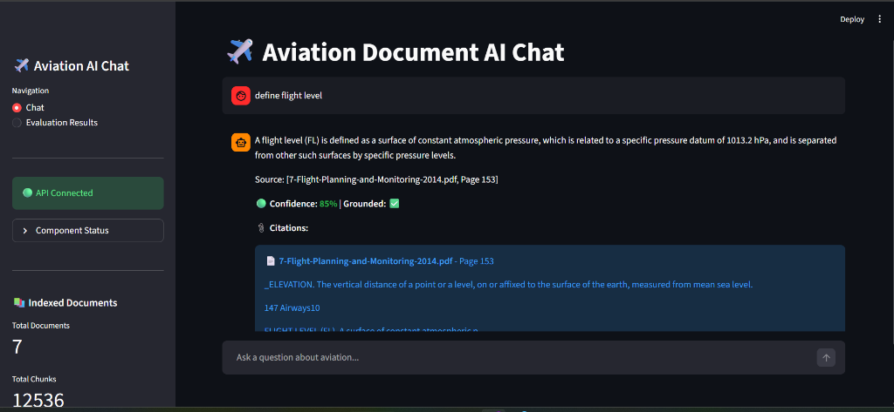

# ✈️ Aviation Document AI Chat

A production-grade Retrieval-Augmented Generation (RAG) system for aviation documents. It features strict grounding, hallucination control, and traceable citations, designed for high-stakes domains.




## 🎯 Overview

This system answers questions **strictly** from provided aviation documents.
- **Strict Refusal**: If an answer isn't in the docs, it refuses to answer.
- **Citations**: Every answer includes `[Document, Page]` citations.
- **Level 1 & 2 Compliance**: Implements mandatory RAG features plus Hybrid Retrieval and Query Routing.

## ✨ Features

### ✅ Level 1: Mandatory
- **Ingestion Pipeline**: Page-aware chunking (512 chars) optimized for aviation manuals.
- **Vector Search**: FAISS index for dense semantic retrieval.
- **Hallucination Control**: Explicit verification against context before answering.
- **Evaluation**: Built-in suite (`evaluate.py`) with 50+ test questions.

### 🚀 Level 2: Advanced
- **Hybrid Retrieval**: Combines **BM25** (keyword) + **Vector** (semantic) search.
- **Reranking**: Uses Cross-Encoders (`ms-marco-MiniLM`) to refine results.
- **Query Router**: Routes questions (Simple vs Complex) to optimize retrieval strategy.
- **Confidence Thresholding**: Flags low-confidence answers with caveats or refusals.

## 🛠️ Architecture

```mermaid
graph TD
    User[User Question] -->|Classify| Router(Query Router)
    Router -->|Set Params| Retrieval[Hybrid Retrieval<br/>(Vector + BM25)]
    Retrieval -->|Top Candidates| CheckRerank{Reranking?}
    CheckRerank -->|Yes| Reranker[Cross-Encoder]
    Reranker --> Context[Context Assembly]
    CheckRerank -->|No| Context
    Context -->|Prompt + Context| LLM[LLM Generation<br/>(GitHub Models)]
    LLM -->|Verify| Grounding{Grounding Check}
    Grounding -->|Pass| Answer[Final Answer]
    Grounding -->|Fail| Refusal[Strict Refusal]
```

## 🚀 Quick Start

### 1. Setup
```bash
# Clone repo
git clone <repo_url>
cd Document-Driven-RAG-Chat

# Setup Backend
cd backend
python -m venv venv
# Windows: venv\Scripts\activate | Linux: source venv/bin/activate
pip install -r requirements.txt

# Environment
copy .env.example .env
# Edit .env and add your GITHUB_TOKEN
```

### 2. Ingest Data
Place PDF files in the `Raw/` directory.
```bash
python ingest.py --path "../Raw/Air Regulation.pdf" 
# Or ingest all: python ingest.py
```

### 3. Run System
```bash
# Run both Backend API and Frontend UI
python run.py
```
App will be available at [`http://localhost:8501`](http://localhost:8501).

## 📊 Evaluation

Run the evaluation suite to verify system performance against the 50-question set.

```bash
python evaluate.py
```

**Metrics Tracked:**
- **Retrieval Hit Rate**: Accuracy of finding relevant chunks.
- **Faithfulness**: Alignment between answer and context.
- **Hallucination Rate**: Frequency of unsupported claims (Target: 0%).

### 📈 Level 2 Comparisons (Bonus)
To prove the efficacy of Hybrid Retrieval (Option 1) vs Vector-Only baseline:
```bash
python scripts/benchmark.py
```
This runs a comparative analysis and saves a report to `data/benchmark/benchmark_report.md`.

## 🔧 API Reference

| Method | Endpoint | Description |
|--------|----------|-------------|
| `POST` | `/ask` | Ask a question. Returns answer + citations. |
| `POST` | `/ingest` | Trigger document ingestion pipeline. |
| `GET` | `/health` | Check status of LLM and Vector Store. |
| `GET` | `/stats` | View index statistics (doc counts, chunks). |

## ⚙️ Configuration

Key settings in `.env`:
- `USE_BM25=true`: Enable hybrid search.
- `USE_RERANKER=true`: Enable cross-encoder reranking.
- `CHUNK_SIZE=512`: Size of text chunks (characters).
- `CHUNK_OVERLAP=128`: Overlap to preserve context.

---
**Disclaimer**: Use for educational purposes. Verify all aviation data with official sources.
